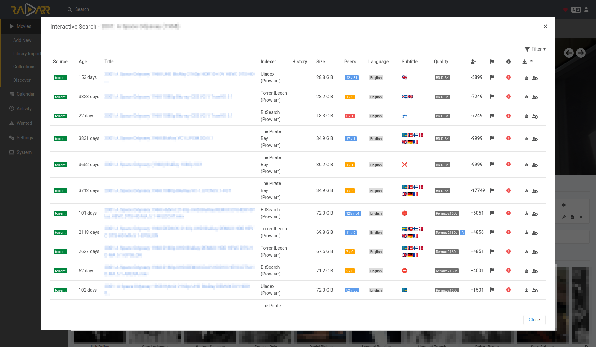

# RadarrSubMonkey

A Tampermonkey script to enhance Radarr's interactive search by adding a
subtitle column that indicates the availability of subtitles in various
languages.

| Icon | Meaning                                    |
|:----:|:-------------------------------------------|
| 🇸🇪   | Indicates the supported languages.         |
| ◌    | Loading tracker page.                      |
| ⛔   | Site access not allowed. Use `@match` and `@connect` in the userscript header to permit access. |
| 💤   | Timeout. The site did not respond in time. |
| ❌   | No configured subtitles found.             |

## Known quirks
- May not work on all torrent sites due to X-Frame-Options restrictions.
  A possible workaround is to use a browser plugin that disables X-Frame-Options.

## Known bugs
- Doesn't always work when filtering.
- No rate limiting is done for the GET requests, which may lead to error 503 on
  some sites.

## Dependencies
- Tampermonkey or similar userscript manager.

## How it works
The script is injected into Radarr and specified torrent sites using
Tampermonkey.

When the user clicks the "Interactive Search" button in Radarr, the script
adds a "Subtitle" column to the results table. For each torrent listed, when
the row becomes visible on the screen, the script fetches the torrent page
and searches for the language keywords indicating the availability of
subtitles in various languages.

If possible, the script first tries to fetch the page using a GET request.
If it doesn't find any subtitles, it tries to load the page in a hidden
iframe instead. This will load the whole page, including any dynamically
loaded content, which the GET request might miss.

The site loaded in the iframe gets injected with the script which searches
for subtitles and sends a message back (with flags) to the Radarr page's
script instance.

The script uses a work queue to limit the number of concurrent requests to
avoid overloading the browser or the torrent sites.

## The RadarrSubMonkey

# Screenshot
